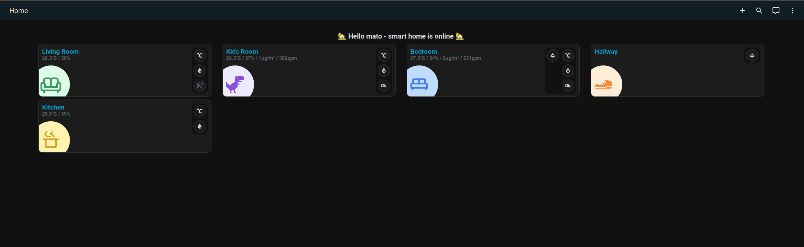

# nix-config

My home server, described in [Nix](https://nixos.org/).

[Home Assistant](https://www.home-assistant.io/), running
alongside a Matter server so it can talk to Thread/Matter devices directly.




## Layout

- `flake.nix` – entry point, wires hosts and users together
- `hosts/thinkcentre` – the machine-specific configuration (networking,
  filesystems, bootloader) for my Lenovo ThinkCentre home server
- `modules/` – reusable pieces of config: `base.nix` (common system settings),
  `gnome.nix` (desktop environment), `homeassistant.nix` (Home Assistant +
  Matter server)
- `users/` – per-user configuration

## Usage

```bash
git clone https://github.com/matofeder/nix-config.git
sudo nixos-rebuild switch --flake ./nix-config#tc
```
